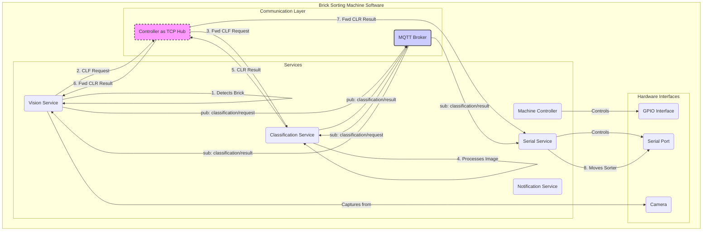

# Brick Sorting Machine - Software Architecture

This document outlines the software architecture for the Brick Sorting Machine. The system is designed as a collection of independent, communicating services. This modular, service-oriented architecture allows for flexibility, scalability, and distributed operation.

The primary goals of this design are:
- **Distribution**: Services can run on different machines, allowing computationally intensive tasks (like image classification) to be offloaded from the machine controller (typically a Raspberry Pi) to a more powerful computer.
- **Modularity**: Each service has a well-defined responsibility, making the system easier to develop, test, and maintain.
- **Extensibility**: The decoupled nature of the services, particularly with the adoption of MQTT, makes it straightforward to add new functionality or integrate third-party modules without modifying the core system.

## Component Diagram

The following diagram illustrates the main components of the software and their interactions. It shows both the legacy TCP-based communication model and the modern MQTT-based model.

## Communication Protocols

The services communicate with each other over the network. This allows them to run on different machines. The project supports two communication models, representing a transition from a tightly-coupled to a loosely-coupled architecture.

### Legacy: TCP Hub-and-Spoke

The original communication model is based on a direct TCP socket connection.

- **Hub**: The `MachineController` service acts as a central server or "hub".
- **Spokes**: All other services (`Vision`, `Classification`, etc.) act as clients that connect directly to the `MachineController`.
- **Message Routing**: The `MachineController` is responsible for routing messages between the other services. For example, it receives a classification request (`CLF`) from the `VisionService` and forwards it to the `ClassificationService`.

This model is simple but creates a tight coupling to the `MachineController`.

### Modern: MQTT Publish-Subscribe

The project is migrating to a more flexible model using the MQTT protocol. This decouples the services from each other.

- **Broker**: An MQTT broker becomes the central communication bus. All services connect to the broker.
- **Publish/Subscribe**: Services publish messages to specific "topics" (e.g., `bricksortingmachine/classification/request`) and subscribe to the topics they are interested in. They do not need to know about each other.
- **Decoupling**: This model allows services to be added or removed without affecting others. For example, a new logging service could simply subscribe to all messages on the broker without any changes to the existing services.

For more details on the MQTT topics and setup, see the `MQTT.md` document. The system currently uses a mix of both methods as the migration is ongoing.

## Core Services

The system is composed of five core services. Each runs as a separate Python process and can be launched via `sorter.py`.

### Machine Controller (`sorter.controller`)

-   **Responsibility**: The "brain" of the sorting machine. It manages the overall state of the machine and controls the physical hardware that is not directly related to sorting individual parts.
-   **Key Logic**:
    -   Controls the main conveyor belt and the vibration feeders via GPIO signals.
    -   Maintains a state machine (`machine_state.py`) to track the operational status (e.g., running, stopped, error).
    -   In the legacy TCP model, it acts as the central communication hub, routing messages between other services.
-   **Launch Command**: `python sorter.py controller`

### Vision Service (`sorter.vision_service`)

-   **Responsibility**: The "eyes" of the system. It watches the conveyor belt for bricks, captures images, and initiates the classification process.
-   **Key Logic**:
    -   Uses a camera to capture a video stream of the conveyor belt.
    -   Employs an object detector (`object_detector.py`) to identify when a brick is in the correct position to be imaged.
    -   Saves an image of the detected brick and sends a classification request (`CLF` message or MQTT publish) with the image path.
    -   Receives classification results to display them in its UI.
    -   Provides a visual interface (using OpenCV) for monitoring the system and for manual control (e.g., soft e-stop).
-   **Launch Command**: `python sorter.py vision --host <controller_host>`

### Classification Service (`sorter.classification_service`)

-   **Responsibility**: The "classifier". It runs a trained machine learning model to identify the type of brick from an image.
-   **Key Logic**:
    -   Listens for classification requests (from the TCP hub or an MQTT topic).
    -   Loads a pre-trained CNN model (e.g., a `.h5` file).
    -   For each request, it loads the specified image, preprocesses it, and runs the model to get a prediction.
    -   Publishes the classification result (`CLR` message or MQTT publish), which includes the predicted class, probability, and other metrics.
    -   This service is computationally intensive and is often run on a separate, more powerful machine.
-   **Launch Command**: `python sorter.py classification --host <controller_or_mqtt_host> --model <path_to_model>`

### Serial Service (`sorter.serial_service`)

-   **Responsibility**: The "hands" of the system. It translates the symbolic classification result into physical action to sort the brick.
-   **Key Logic**:
    -   Listens for classification results.
    -   Uses a `class_pose_map` to look up the physical coordinates (rotation and elevation) corresponding to the predicted brick type.
    -   Sends a command over a serial connection (e.g., to an Arduino) that controls the servos or actuators of the sorting mechanism (the "slide").
-   **Launch Command**: `python sorter.py serial --host <controller_or_mqtt_host>`

### Notification Service (`sorter.notification_service`)

-   **Responsibility**: The "voice" of the system. It provides feedback to the user.
-   **Key Logic**:
    -   Listens for notification events.
    -   Can play themed `.wav` sounds for different events (e.g., a specific sound for each type of brick classified).
    -   Can send push notifications via a service like Pushover for critical alerts (e.g., E-Stop, machine running out of parts).
-   **Launch Command**: `python sorter.py notification --host <controller_or_mqtt_host> --theme <sound_theme>`

## End-to-End Sorting Workflow

To illustrate how the services work together, here is a step-by-step walkthrough of a single brick being sorted. This example assumes the modern MQTT communication model is in use.

1.  **Detection**: The `VisionService` monitors the camera feed. Its object detector identifies that a brick has arrived at the correct position on the conveyor belt.
2.  **Image Capture**: The `VisionService` captures an image of the brick and saves it to a local directory.
3.  **Classification Request**: The `VisionService` publishes a message to the `bricksortingmachine/classification/request` MQTT topic. The message contains a unique ID for the brick and the file path to the captured image.
4.  **Model Inference**: The `ClassificationService`, which is subscribed to the request topic, receives the message. It loads the image, runs its machine learning model, and determines the most likely class for the brick (e.g., "plate2x").
5.  **Classification Result**: The `ClassificationService` publishes the result to the `bricksortingmachine/classification/result` MQTT topic. The message includes the original object ID and the predicted class.
6.  **Physical Sorting**: The `SerialService`, subscribed to the result topic, receives the message. It looks up "plate2x" in its `class_pose_map` to find the correct servo coordinates. It then sends a command (e.g., `GOT 90 170\n`) via the serial port to the microcontroller, which moves the sorting slide to the correct bin.
7.  **User Feedback**:
    -   The `VisionService`, also subscribed to the result topic, updates its user interface to display the predicted class for the brick it detected.
    -   The `NotificationService` might also receive the result (or a separate notification event) and play a corresponding sound for "plate2x".

This entire process happens in a fraction of a second, allowing the machine to sort bricks continuously.

## Extensibility

The modular, service-oriented design, particularly with the MQTT communication model, makes the system highly extensible. New or third-party modules can be added to the system with minimal changes to the existing codebase.

The key is to use the MQTT broker as a shared communication bus. A new module can be created as a standalone service that connects to the broker and subscribes to or publishes on relevant topics.

### Example: Adding a Data Logging Service

Imagine you want to create a service that logs every classification result to a database for later analysis. You could:

1.  Create a new Python script for your `LoggingService`.
2.  In this script, connect to the same MQTT broker that the other services are using.
3.  Subscribe to the `bricksortingmachine/classification/result` topic.
4.  In your message handler, parse the incoming JSON payload and write the relevant information (timestamp, predicted class, probability, etc.) to your database of choice (e.g., SQLite, InfluxDB).
5.  Run your service alongside the existing services.

No changes would be needed in the `ClassificationService` (which publishes the data) or any other core service.

### Example: Adding a New Sorting Mechanism

If you were to build a different physical sorting mechanism that required different commands, you could:

1.  Create a `MyNewSerialService` that contains the specific logic for controlling your new hardware.
2.  Like the original `SerialService`, this new service would subscribe to the `bricksortingmachine/classification/result` topic.
3.  Instead of a `class_pose_map`, it would implement its own logic to translate the predicted class into the commands required by the new hardware.
4.  You would then run your new service *instead of* the original one.
